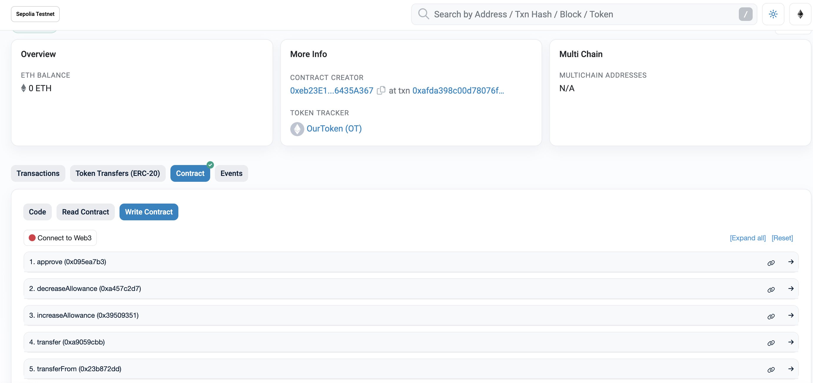

# Foundry ERC20



Contract CODE: https://sepolia.etherscan.io/address/0x8400afe076317d550224f6e9605808c020e9ae5d#code

## Quickstart

```
git clone https://github.com/Solidityarchitect/foundry-erc20
cd foundry-erc20
forge install
forge build
```

# Usage

## OpenZeppelin

[OpenZeppelin Contracts Docs](https://docs.openzeppelin.com/contracts/4.x/)
<br><br>
[OpenZeppelin GitHub Repo](https://github.com/OpenZeppelin/openzeppelin-contracts)
<br>

### Installing OpenZeppelin Contracts Package

```bash
forge install OpenZeppelin/openzeppelin-contracts --no-commit
```

## Start a local node

```
make anvil
```

## Deploy

This will default to your local node. You need to have it running in another terminal in order for it to deploy.

```
make deploy
```

## Deploy - Other Network

[See below](#deployment-to-a-testnet-or-mainnet)

## Testing

We talk about 4 test tiers in the video.

1. Unit
2. Integration
3. Forked
4. Staging

This repo we cover #1 and #3.

```
forge test
```

or

```
forge test --fork-url $SEPOLIA_RPC_URL
```

### Test Coverage

```
forge coverage
```
